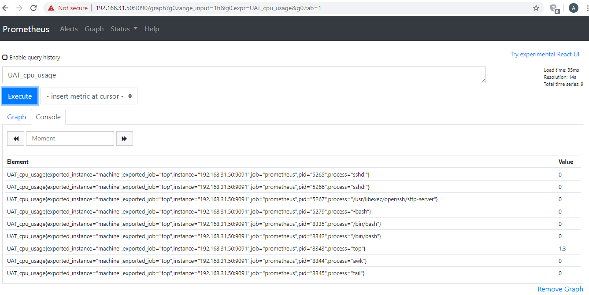
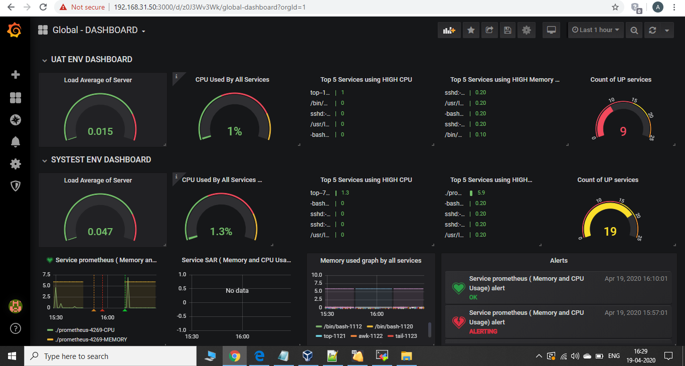

# Monitoring Dashboard
Applications / Services Detail monitoring setup in 30 Minutes using Prometheus and Grafana. Can monitor (CPU/Memory/Status/Alert) of all the application services running on different Linux machines.

Steps to create Dashboard in thirty minutes:
1. Any Flavour of Linux OS as per your choice (In my case I am using centos 7).

2. If you want very straight forward setup install Docker on the selected machine to install and run required application.
   Docker Installation on Cent OS.
   ```
   sudo yum install -y yum-utils
   sudo yum-config-manager     --add-repo     https://download.docker.com/linux/centos/docker-ce.repo
   sudo yum install docker-ce docker-ce-cli containerd.io
   sudo systemctl start docker
   sudo docker run hello-world 
   ###this should Print hello world from Docker ( Successful configuration of Docker )
   ```
   
3. Pull the Prometheus push-gateway image from the docker and run as below.
   ```
   sudo docker pull prom/pushgateway
   sudo docker run -d -p 9091:9091 --name pushgateway prom/pushgateway
   sudo docker ps
   4ddeb1120158        prom/pushgateway        "/bin/pushgateway"   28 hours ago        Up 4 hours          0.0.0.0:9091->9091/tcp   pushgateway
   ```
   Dont Want to use docker: (use below steps).
   ```
   wget https://github.com/prometheus/pushgateway/releases/download/v0.8.0/pushgateway-0.8.0.linux-amd64.tar.gz
   > tar xvzf pushgateway-0.8.0.linux-amd64.tar.gz
   > cd pushgateway-0.8.0.linux-amd64/   
   > ./pushgateway &
   Listening on :9091   
   ```

4. Installing Grafana as Docker Image/Process.
   ``` 
   sudo docker run -d -p 3000:3000 --name grafana grafana/grafana:6.5.0
   sudo docker ps
   CONTAINER ID        IMAGE                   COMMAND              CREATED             STATUS              PORTS                    NAMES
   94253d2145de        grafana/grafana:6.5.0   "/run.sh"            27 hours ago        Up 4 hours          0.0.0.0:3000->3000/tcp   grafana
   4ddeb1120158        prom/pushgateway        "/bin/pushgateway"   28 hours ago        Up 4 hours          0.0.0.0:9091->9091/tcp   pushgateway
   ```
   Dont Want to use docker: (Follow this link for Installation) 
   https://grafana.com/docs/grafana/latest/installation/rpm/

5. Open the required ports from Centos. 
   ```    
   sudo firewall-cmd --permanent --add-port=9090/tcp
   sudo firewall-cmd --permanent --add-port=9091/tcp
   sudo firewall-cmd --reload
   sudo firewall-cmd --list-ports
   ```
 
6. Install the Prometheus.
   ```
   cd /home/monitor/prometheus   
   wget https://github.com/prometheus/prometheus/releases/download/v2.17.1/prometheus-2.17.1.linux-amd64.tar.gz
   tar xvzf prometheus-2.17.1.linux-amd64.tar.gz
   cd prometheus-2.17.1.linux-amd64
   ```
   open the file prometheus.yml and change below values.
   ```
   vi prometheus.yml
   # my global config
   global:
     scrape_interval:     60s # Set the scrape interval to every 15 seconds. Default is every 1 minute.
     evaluation_interval: 60s # Evaluate rules every 15 seconds. The default is every 1 minute.
     # scrape_timeout is set to the global default (10s).
     
       static_configs:
       - targets: ['192.168.31.50:9090', '192.168.31.50:9091']  #(Change the ip as per your host/server)
   ```
    Start the Prometheus server.   
   ```     
   ./prometheus --web.listen-address="192.168.31.50:9090" & #(Change the ip as per your host/server)
   ```

7. Check the below links in browser: 
   ```    
   http://192.168.31.50:9090/graph (Prometheus)
   http://192.168.31.50:3000/      (Grafana) -- userid/password (admin/admin) (change it after first login)
   ```
8. Configuring the multiple clients/hosts to send the Matrix to the Gateway.
   We are using simple bash script to fetch the matrix from each server and post it to the gateway. You can also use "node_exporter" to get the details but I havent tried it yet. 
   We will configure the script as crontab job to run every one minute of interval.
   It will not generate any IOPS on the server as its not logging any details on client side and just running basic monitoring commands such as - top,awk,tail.
   CPU and memory utilization is < 0.9.
   
9. You can parameterize below script as per your requirements.
```
#!/bin/bash
# script to collect the cpu and memory usage of the given tool
TOOL=`hostname`
service_user='osboxes'
if [ ! -z "$1" ]
then
TOOL=$1
fi

# add load average
var=`cat /proc/loadavg | cut -d' ' -f1 | xargs echo $TOOL"_load_average" `
var=$var

# collect cpu usage
# top displays wrong results on the first iteration – run it twice an grep away the firt output
LINES=`top -bcn2 -u ${service_user} | awk '/^top -/ { p=!p } { if (!p) print }' | tail -n +8`

while read -r LINE
do
IN=`echo "$LINE" | tr -s ' '`
PID=`echo $IN | cut -d ' ' -f1 `
CMD=`echo $IN | cut -d ' ' -f12 `
CPU=`echo $IN | cut -d ' ' -f9 `
MEM=`echo $IN | cut -d ' ' -f10 `
var=$var$(printf "${TOOL}_cpu_usage{process=\"$CMD\", pid=\"$PID\"} $CPU\n")
var="$var"

var=$var$(printf "${TOOL}_memory_usage{process=\"$CMD\", pid=\"$PID\"} $MEM\n")
var="$var"
done <<< "$LINES"

echo $var

# push to the prometheus pushgateway
curl –noproxy "*" -X POST -H "Content-Type: text/plain" --data "$var" http://192.168.31.50:9091/metrics/job/top/instance/machine
```



